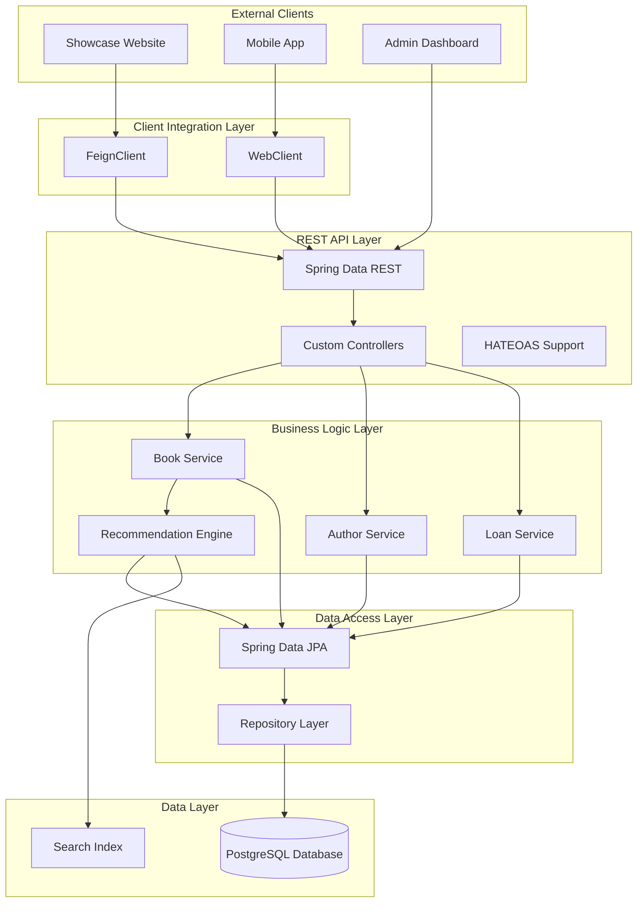
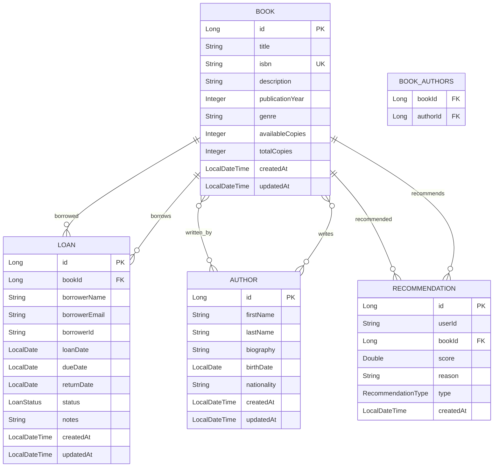

# Design Document

## Overview

The library management system is a REST service built with Spring Boot and Spring Data REST for managing books, authors, and loans. The system provides comprehensive REST APIs with HATEOAS support, external client integration via FeignClient/WebClient, and an automatic recommendation engine. The architecture follows RESTful principles and supports integration with external showcase applications.

## Architecture

### High-Level Architecture



### Technology Stack

**Backend Core:**
- Spring Boot 3.x
- Spring Data REST for automatic REST endpoint generation
- Spring Data JPA with Hibernate
- Spring HATEOAS for hypermedia-driven APIs
- Maven for dependency management

**Client Integration:**
- OpenFeign for declarative REST clients
- Spring WebClient for reactive HTTP calls
- Spring Cloud OpenFeign for service-to-service communication

**Data & Search:**
- PostgreSQL for primary data storage
- Spring Data JPA for data access
- Custom query methods for advanced search
- Optional: Elasticsearch for full-text search

**Documentation & Testing:**
- SpringDoc OpenAPI 3 for API documentation
- Spring Boot Test for integration testing
- TestContainers for database testing

## Components and Interfaces

### REST API Endpoints

#### Spring Data REST Auto-Generated Endpoints
```
GET /api/books                    # List all books with pagination
GET /api/books/{id}              # Get specific book
POST /api/books                  # Create new book
PUT /api/books/{id}              # Update book
PATCH /api/books/{id}            # Partial update book
DELETE /api/books/{id}           # Delete book

GET /api/authors                 # List all authors with pagination
GET /api/authors/{id}            # Get specific author
POST /api/authors                # Create new author
PUT /api/authors/{id}            # Update author
DELETE /api/authors/{id}         # Delete author

GET /api/loans                   # List all loans with pagination
GET /api/loans/{id}              # Get specific loan
POST /api/loans                  # Create new loan
PUT /api/loans/{id}              # Update loan
DELETE /api/loans/{id}           # Delete loan
```

#### Custom Controller Endpoints
```
GET /api/books/search/findByTitle?title={title}
GET /api/books/search/findByAuthor?author={author}
GET /api/books/search/findByIsbn?isbn={isbn}
GET /api/books/search/findByGenre?genre={genre}

GET /api/authors/{id}/books      # Get books by author
GET /api/authors/search/findByName?name={name}

GET /api/loans/overdue           # Get overdue loans
GET /api/loans/active            # Get active loans
PUT /api/loans/{id}/return       # Return a book
GET /api/loans/borrower/{borrowerId}  # Get loans by borrower

GET /api/recommendations/{userId}     # Get recommendations for user
GET /api/recommendations/popular      # Get popular books
GET /api/recommendations/trending     # Get trending books
```

### FeignClient Interface Definitions

#### BookClient Interface
```java
@FeignClient(name = "book-service", url = "${book.service.url}")
public interface BookClient {
    
    @GetMapping("/api/books")
    PagedModel<Book> getAllBooks(@RequestParam(defaultValue = "0") int page,
                                @RequestParam(defaultValue = "20") int size);
    
    @GetMapping("/api/books/{id}")
    Book getBookById(@PathVariable Long id);
    
    @GetMapping("/api/books/search/findByTitle")
    PagedModel<Book> findBooksByTitle(@RequestParam String title);
    
    @GetMapping("/api/authors/{authorId}/books")
    PagedModel<Book> getBooksByAuthor(@PathVariable Long authorId);
}
```

#### AuthorClient Interface
```java
@FeignClient(name = "author-service", url = "${book.service.url}")
public interface AuthorClient {
    
    @GetMapping("/api/authors")
    PagedModel<Author> getAllAuthors(@RequestParam(defaultValue = "0") int page,
                                   @RequestParam(defaultValue = "20") int size);
    
    @GetMapping("/api/authors/{id}")
    Author getAuthorById(@PathVariable Long id);
    
    @GetMapping("/api/authors/search/findByName")
    PagedModel<Author> findAuthorsByName(@RequestParam String name);
}
```

### WebClient Configuration

#### Reactive Client Setup
```java
@Configuration
public class WebClientConfig {
    
    @Bean
    public WebClient bookServiceWebClient() {
        return WebClient.builder()
            .baseUrl("${book.service.url}")
            .defaultHeader(HttpHeaders.CONTENT_TYPE, MediaType.APPLICATION_JSON_VALUE)
            .build();
    }
}
```

## Data Models

### Core Entities

#### Book Entity
```java
@Entity
@Table(name = "books")
public class Book {
    @Id
    @GeneratedValue(strategy = GenerationType.IDENTITY)
    private Long id;
    
    @Column(nullable = false)
    private String title;
    
    @Column(unique = true, nullable = false)
    private String isbn;
    
    @Column(length = 2000)
    private String description;
    
    @Column(name = "publication_year")
    private Integer publicationYear;
    
    private String genre;
    
    @Column(name = "available_copies")
    private Integer availableCopies;
    
    @Column(name = "total_copies")
    private Integer totalCopies;
    
    @ManyToMany(mappedBy = "books", fetch = FetchType.LAZY)
    private Set<Author> authors = new HashSet<>();
    
    @OneToMany(mappedBy = "book", cascade = CascadeType.ALL)
    private Set<Loan> loans = new HashSet<>();
    
    @CreationTimestamp
    private LocalDateTime createdAt;
    
    @UpdateTimestamp
    private LocalDateTime updatedAt;
}
```

#### Author Entity
```java
@Entity
@Table(name = "authors")
public class Author {
    @Id
    @GeneratedValue(strategy = GenerationType.IDENTITY)
    private Long id;
    
    @Column(name = "first_name", nullable = false)
    private String firstName;
    
    @Column(name = "last_name", nullable = false)
    private String lastName;
    
    @Column(length = 1000)
    private String biography;
    
    @Column(name = "birth_date")
    private LocalDate birthDate;
    
    private String nationality;
    
    @ManyToMany(cascade = {CascadeType.PERSIST, CascadeType.MERGE})
    @JoinTable(
        name = "book_authors",
        joinColumns = @JoinColumn(name = "author_id"),
        inverseJoinColumns = @JoinColumn(name = "book_id")
    )
    private Set<Book> books = new HashSet<>();
    
    @CreationTimestamp
    private LocalDateTime createdAt;
    
    @UpdateTimestamp
    private LocalDateTime updatedAt;
}
```

#### Loan Entity
```java
@Entity
@Table(name = "loans")
public class Loan {
    @Id
    @GeneratedValue(strategy = GenerationType.IDENTITY)
    private Long id;
    
    @ManyToOne(fetch = FetchType.LAZY)
    @JoinColumn(name = "book_id", nullable = false)
    private Book book;
    
    @Column(name = "borrower_name", nullable = false)
    private String borrowerName;
    
    @Column(name = "borrower_email", nullable = false)
    private String borrowerEmail;
    
    @Column(name = "borrower_id")
    private String borrowerId;
    
    @Column(name = "loan_date", nullable = false)
    private LocalDate loanDate;
    
    @Column(name = "due_date", nullable = false)
    private LocalDate dueDate;
    
    @Column(name = "return_date")
    private LocalDate returnDate;
    
    @Enumerated(EnumType.STRING)
    private LoanStatus status; // ACTIVE, RETURNED, OVERDUE
    
    @Column(length = 500)
    private String notes;
    
    @CreationTimestamp
    private LocalDateTime createdAt;
    
    @UpdateTimestamp
    private LocalDateTime updatedAt;
}
```

#### Recommendation Entity
```java
@Entity
@Table(name = "recommendations")
public class Recommendation {
    @Id
    @GeneratedValue(strategy = GenerationType.IDENTITY)
    private Long id;
    
    @Column(name = "user_id")
    private String userId;
    
    @ManyToOne(fetch = FetchType.LAZY)
    @JoinColumn(name = "book_id", nullable = false)
    private Book book;
    
    @Column(name = "recommendation_score")
    private Double score;
    
    @Column(name = "recommendation_reason")
    private String reason;
    
    @Enumerated(EnumType.STRING)
    private RecommendationType type; // COLLABORATIVE, CONTENT_BASED, POPULAR, TRENDING
    
    @CreationTimestamp
    private LocalDateTime createdAt;
}
```

### Database Schema Design



## Error Handling

### Frontend Error Handling
- **Global Error Boundary**: Catch and display React component errors
- **API Error Interceptor**: Handle HTTP errors consistently
- **Form Validation**: Client-side validation with user-friendly messages
- **Network Error Handling**: Offline detection and retry mechanisms

### Backend Error Handling
- **Global Exception Handler**: Centralized error response formatting
- **Custom Exceptions**: Business logic specific exceptions
- **Validation Errors**: Bean validation with detailed error messages
- **Security Exceptions**: Authentication and authorization error handling

```java
@ControllerAdvice
public class GlobalExceptionHandler {
    
    @ExceptionHandler(BookNotFoundException.class)
    public ResponseEntity<ErrorResponse> handleBookNotFound(BookNotFoundException ex) {
        return ResponseEntity.status(HttpStatus.NOT_FOUND)
            .body(new ErrorResponse("BOOK_NOT_FOUND", ex.getMessage()));
    }
    
    @ExceptionHandler(InsufficientStockException.class)
    public ResponseEntity<ErrorResponse> handleInsufficientStock(InsufficientStockException ex) {
        return ResponseEntity.status(HttpStatus.BAD_REQUEST)
            .body(new ErrorResponse("INSUFFICIENT_STOCK", ex.getMessage()));
    }
}
```

## Testing Strategy

### Frontend Testing
- **Unit Tests**: Jest and React Testing Library for component testing
- **Integration Tests**: Testing component interactions and API calls
- **E2E Tests**: Cypress for critical user flows
- **Accessibility Tests**: Automated accessibility testing with axe-core

### Backend Testing
- **Unit Tests**: JUnit 5 for service and utility classes
- **Integration Tests**: Spring Boot Test for repository and API testing
- **Security Tests**: Testing authentication and authorization flows
- **Performance Tests**: Load testing for critical endpoints

```java
@SpringBootTest
@AutoConfigureTestDatabase(replace = AutoConfigureTestDatabase.Replace.NONE)
class BookServiceIntegrationTest {
    
    @Autowired
    private BookService bookService;
    
    @Test
    void shouldCreateBookSuccessfully() {
        // Test implementation
    }
    
    @Test
    void shouldThrowExceptionWhenBookNotFound() {
        // Test implementation
    }
}
```

### Test Data Management
- **Test Fixtures**: Predefined test data for consistent testing
- **Database Seeding**: Automated test data setup
- **Mock Services**: External service mocking for isolated testing

## Security Considerations

### Authentication & Authorization
- JWT tokens with appropriate expiration times
- Role-based access control (RBAC)
- Password hashing with BCrypt
- CSRF protection for state-changing operations

### Data Protection
- Input validation and sanitization
- SQL injection prevention through parameterized queries
- XSS protection with proper output encoding
- HTTPS enforcement for all communications

### API Security
- Rate limiting to prevent abuse
- CORS configuration for cross-origin requests
- API versioning for backward compatibility
- Request/response logging for audit trails

## Performance Optimization

### Frontend Optimization
- Code splitting and lazy loading
- Image optimization and lazy loading
- Caching strategies for API responses
- Bundle size optimization

### Backend Optimization
- Database query optimization with proper indexing
- Connection pooling for database connections
- Caching frequently accessed data
- Pagination for large result sets

### Infrastructure Considerations
- CDN for static asset delivery
- Database read replicas for scaling reads
- Application monitoring and logging
- Horizontal scaling capabilities