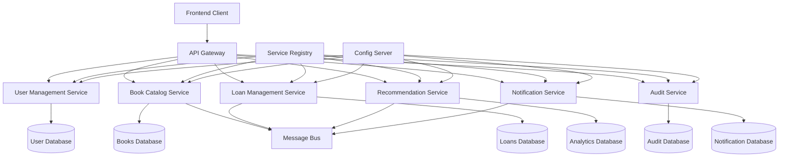

# Microservices Migration Design Document

## Overview

This design document outlines the architecture for migrating the monolithic bookstore application to a microservices-based system. The design focuses on service decomposition, inter-service communication, data management, and maintaining system reliability while improving scalability and maintainability.

## Architecture

### High-Level Architecture



### Service Decomposition Strategy

Based on domain-driven design principles and the existing monolith structure, the system will be decomposed into six core microservices:

1. **User Management Service** - Handles authentication, authorization, and user profiles
2. **Book Catalog Service** - Manages books, authors, and catalog operations
3. **Loan Management Service** - Handles borrowing, returns, and loan tracking
4. **Recommendation Service** - Provides book recommendations and analytics
5. **Audit Service** - Centralized logging and audit trail management
6. **Notification Service** - Email notifications and alerts

## Components and Interfaces

### 1. API Gateway

**Technology:** Spring Cloud Gateway
**Responsibilities:**
- Request routing to appropriate microservices
- Authentication and authorization
- Rate limiting and throttling
- Request/response transformation
- Load balancing
- Circuit breaker implementation

**Key Configuration:**
```yaml
spring:
  cloud:
    gateway:
      routes:
        - id: user-service
          uri: lb://user-management-service
          predicates:
            - Path=/api/users/**, /api/auth/**
        - id: book-service
          uri: lb://book-catalog-service
          predicates:
            - Path=/api/books/**, /api/authors/**
        - id: loan-service
          uri: lb://loan-management-service
          predicates:
            - Path=/api/loans/**
```

### 2. User Management Service

**Port:** 8081
**Database:** PostgreSQL (users, roles, permissions)
**Responsibilities:**
- User registration and authentication
- JWT token generation and validation
- Role-based access control
- User profile management

**Key Entities:**
- User (id, username, email, password, roles)
- Role (id, name, permissions)

**API Endpoints:**
- POST /api/auth/login
- POST /api/auth/register
- GET /api/users/{id}
- PUT /api/users/{id}

### 3. Book Catalog Service

**Port:** 8082
**Database:** PostgreSQL (books, authors, categories)
**Responsibilities:**
- Book and author management
- Catalog search and filtering
- Book availability tracking
- Category management

**Key Entities:**
- Book (id, title, isbn, authors, categories, totalCopies, availableCopies)
- Author (id, name, biography, books)
- Category (id, name, description)

**API Endpoints:**
- GET /api/books
- POST /api/books
- GET /api/books/{id}
- PUT /api/books/{id}
- GET /api/authors
- POST /api/authors

### 4. Loan Management Service

**Port:** 8083
**Database:** PostgreSQL (loans, loan_tracking)
**Responsibilities:**
- Loan creation and management
- Return processing
- Overdue tracking
- Loan history

**Key Entities:**
- Loan (id, userId, bookId, loanDate, dueDate, returnDate, status)
- LoanTracking (id, loanId, status, timestamp, notes)

**API Endpoints:**
- POST /api/loans
- GET /api/loans/user/{userId}
- PUT /api/loans/{id}/return
- GET /api/loans/{id}/history

### 5. Recommendation Service

**Port:** 8084
**Database:** MongoDB (recommendations, analytics)
**Responsibilities:**
- Generate book recommendations
- Track user preferences
- Analytics and reporting
- Machine learning model integration

**Key Entities:**
- Recommendation (id, userId, bookId, score, reason, timestamp)
- UserPreference (id, userId, categories, authors, ratings)

**API Endpoints:**
- GET /api/recommendations/user/{userId}
- POST /api/recommendations/feedback
- GET /api/analytics/popular-books

### 6. Audit Service

**Port:** 8085
**Database:** Elasticsearch (audit_logs)
**Responsibilities:**
- Centralized audit logging
- Compliance reporting
- Security monitoring
- Log aggregation and search

**Key Entities:**
- AuditLog (id, userId, action, resourceType, resourceId, timestamp, details)

**API Endpoints:**
- POST /api/audit/log
- GET /api/audit/logs
- GET /api/audit/user/{userId}

### 7. Notification Service

**Port:** 8086
**Database:** PostgreSQL (notifications, templates)
**Responsibilities:**
- Email notifications
- SMS alerts (future)
- Push notifications (future)
- Template management

**Key Entities:**
- Notification (id, userId, type, subject, content, status, timestamp)
- NotificationTemplate (id, type, subject, content)

**API Endpoints:**
- POST /api/notifications/send
- GET /api/notifications/user/{userId}
- POST /api/notifications/templates

## Data Models

### Database Per Service Pattern

Each microservice will have its own database to ensure loose coupling:

1. **User Management Service:** PostgreSQL
   - Tables: users, roles, user_roles, permissions

2. **Book Catalog Service:** PostgreSQL
   - Tables: books, authors, book_authors, categories, book_categories

3. **Loan Management Service:** PostgreSQL
   - Tables: loans, loan_tracking

4. **Recommendation Service:** MongoDB
   - Collections: recommendations, user_preferences, analytics

5. **Audit Service:** Elasticsearch
   - Indices: audit_logs, security_events

6. **Notification Service:** PostgreSQL
   - Tables: notifications, notification_templates

### Data Consistency Strategy

- **Eventual Consistency:** Services will use event-driven architecture for data synchronization
- **Saga Pattern:** For distributed transactions (e.g., loan creation involving book availability update)
- **Event Sourcing:** For audit trail and state reconstruction

## Error Handling

### Circuit Breaker Pattern
- Implement Hystrix or Resilience4j for fault tolerance
- Configure fallback mechanisms for critical operations
- Monitor circuit breaker states

### Retry Mechanisms
- Exponential backoff for transient failures
- Maximum retry limits to prevent cascading failures
- Dead letter queues for failed messages

### Error Response Format
```json
{
  "timestamp": "2024-11-29T10:30:00Z",
  "status": 500,
  "error": "Internal Server Error",
  "message": "Service temporarily unavailable",
  "path": "/api/books/123",
  "correlationId": "abc-123-def"
}
```

## Testing Strategy

### Unit Testing
- Each service will maintain 80%+ code coverage
- Mock external dependencies
- Test business logic in isolation

### Integration Testing
- Contract testing between services using Pact
- Database integration tests with Testcontainers
- Message queue integration tests

### End-to-End Testing
- API Gateway to service communication
- Complete user workflows
- Performance testing under load

### Service Testing
- Health check endpoints
- Graceful degradation testing
- Chaos engineering with tools like Chaos Monkey

## Infrastructure Components

### Service Registry
- **Technology:** Netflix Eureka or Consul
- **Purpose:** Service discovery and health monitoring
- **Configuration:** Auto-registration and heartbeat monitoring

### Configuration Management
- **Technology:** Spring Cloud Config Server
- **Purpose:** Centralized configuration management
- **Features:** Environment-specific configs, refresh without restart

### Message Broker
- **Technology:** RabbitMQ or Apache Kafka
- **Purpose:** Asynchronous communication between services
- **Patterns:** Event sourcing, CQRS, pub/sub messaging

### Monitoring and Observability
- **Metrics:** Prometheus + Grafana
- **Logging:** ELK Stack (Elasticsearch, Logstash, Kibana)
- **Tracing:** Jaeger or Zipkin for distributed tracing
- **Health Checks:** Spring Boot Actuator

### Security
- **Authentication:** JWT tokens with RS256 signing
- **Authorization:** Role-based access control (RBAC)
- **Service-to-Service:** mTLS or API keys
- **Secrets Management:** HashiCorp Vault or Kubernetes secrets

## Deployment Architecture

### Containerization
- Each service packaged as Docker container
- Multi-stage builds for optimized image sizes
- Health check endpoints for container orchestration

### Kubernetes Deployment
```yaml
apiVersion: apps/v1
kind: Deployment
metadata:
  name: book-catalog-service
spec:
  replicas: 3
  selector:
    matchLabels:
      app: book-catalog-service
  template:
    metadata:
      labels:
        app: book-catalog-service
    spec:
      containers:
      - name: book-catalog-service
        image: bookstore/book-catalog-service:latest
        ports:
        - containerPort: 8082
        env:
        - name: SPRING_PROFILES_ACTIVE
          value: "kubernetes"
        livenessProbe:
          httpGet:
            path: /actuator/health
            port: 8082
          initialDelaySeconds: 60
          periodSeconds: 30
```

### CI/CD Pipeline
- Individual pipelines for each service
- Automated testing at each stage
- Blue-green or canary deployments
- Rollback capabilities

## Migration Strategy

### Strangler Fig Pattern
1. **Phase 1:** Implement API Gateway and route existing requests to monolith
2. **Phase 2:** Extract User Management Service, route auth requests to new service
3. **Phase 3:** Extract Book Catalog Service, maintain data synchronization
4. **Phase 4:** Extract remaining services one by one
5. **Phase 5:** Decommission monolith once all functionality is migrated

### Data Migration
- Implement dual-write pattern during transition
- Use database replication for data consistency
- Gradual cutover with rollback capabilities
- Comprehensive data validation and integrity checks

This design provides a robust foundation for migrating from monolith to microservices while maintaining system reliability and enabling future scalability.